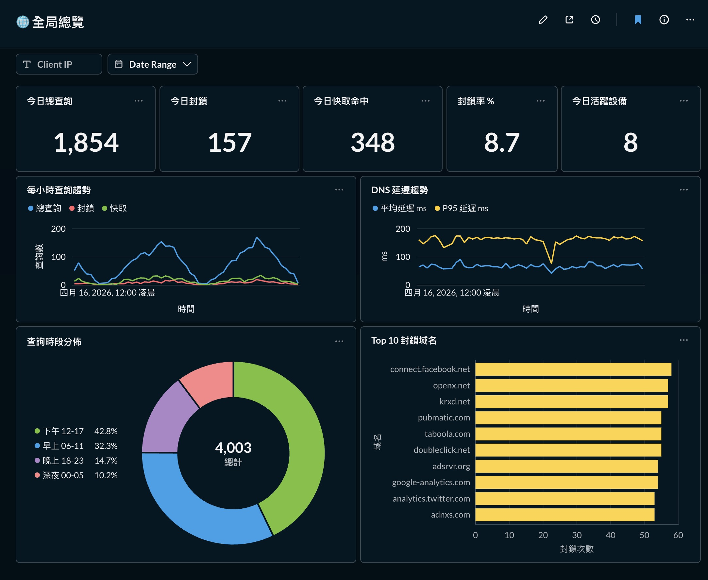
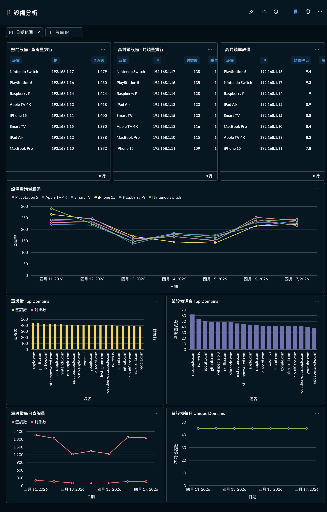
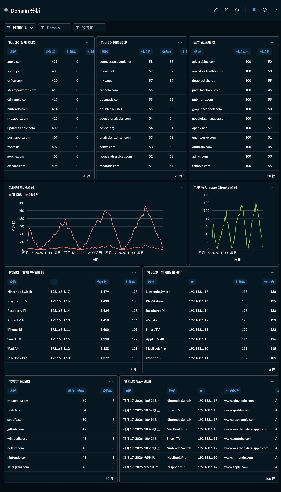

# AGH Analytics

**English** | [中文](#中文說明)

Turn your [AdGuard Home](https://adguard.com/adguard-home.html) DNS logs into a real-time analytics dashboard — automatically.

```
AdGuard Home  →  Python ETL  →  PostgreSQL  →  Metabase
  (DNS logs)     (every 5 min)   (14-day store)  (3 dashboards)
```

## Dashboards

### 🌐 Dashboard 1 — Global Overview
Today's KPIs, hourly query trends, block rate, and latency (avg + P95).



### 📱 Dashboard 2 — Device Analysis
Per-device query volume, block rankings, and top domains per device.



### 🔍 Dashboard 3 — Domain Analysis
Top queried / blocked domains, late-night traffic, and per-domain device breakdown.



All dashboards support **Date Range**, **Device IP**, and **Domain** filters.

---

## Why Build This?

AdGuard Home's built-in UI only shows the last few hundred log entries with no trend analysis or cross-device comparison. This project answers questions like:

- Which device is making the most DNS queries?
- Which domains are blocked most often, and by whom?
- Is there suspicious late-night traffic?
- How has my block rate changed over time?

---

## Architecture

```
┌─────────────────────────────────────────────────────┐
│                  Docker Compose                      │
│                                                     │
│  ┌──────────┐   ┌──────────────┐   ┌─────────────┐ │
│  │PostgreSQL│   │  ETL (Python)│   │  Metabase   │ │
│  │          │←──│              │   │  port 3001  │ │
│  │ port 5432│   │ cron: 5 min  │   │             │ │
│  └──────────┘   └──────────────┘   └─────────────┘ │
└─────────────────────────────────────────────────────┘
         ↑                  ↑
    stores data        polls AGH API
                    /control/querylog
```

**ETL pipeline:**
1. Polls AGH `/control/querylog` every 5 minutes (cursor-based, no duplicates)
2. Normalises records — extracts `root_domain` (tldextract), maps AGH reasons → `response_status`, computes SHA-256 dedup fingerprint
3. Inserts into `dns_queries` raw table (`ON CONFLICT DO NOTHING`)
4. Hourly job rebuilds 5 aggregate tables (1h / 1d buckets) for fast dashboard queries

**Design choices:**

| Choice | Reason |
|--------|--------|
| Python ETL | AGH API needs cursor pagination and field normalisation |
| PostgreSQL | `inet` type, window functions, Metabase compatibility |
| Aggregate tables | Raw table grows to 100k+ rows; pre-aggregation keeps dashboards fast |
| Docker Compose | Single command deploy, auto-restart on reboot |
| Native SQL in Metabase | More flexible than GUI builder; supports template tag filters |

---

## Requirements

- Docker + Docker Compose
- AdGuard Home with API access enabled
- ~1 GB disk for PostgreSQL data (14-day retention)
- ~512 MB RAM for Metabase JVM

---

## Installation

### 1. Clone and configure

```bash
git clone https://github.com/Johnny-Kao/agh-analytics.git
cd agh-analytics/agh_pg_etl
cp .env.example .env
```

Edit `.env`:

```env
AGH_BASE_URL=http://YOUR_AGH_HOST/control   # AGH control API base URL
AGH_USERNAME=your-username
AGH_PASSWORD=your-password

PG_PASSWORD=change-me-strong-password       # Choose a strong password
```

### 2. Start the stack

```bash
docker compose up -d
```

On first start:
- PostgreSQL schema is created automatically
- ETL backfills the last 7 days of AGH query logs
- Metabase is available at `http://YOUR_HOST:3001`

### 3. Configure Metabase

1. Open `http://YOUR_HOST:3001` and complete the setup wizard
2. Add a PostgreSQL database connection:
   - Host: your server IP (not `postgres` — Metabase connects externally)
   - Port: `5432` / Database: `agh_analytics` / User: `agh`
   - Password: value of `PG_PASSWORD` in your `.env`
3. Create native SQL questions using the schema in [`metabase_dashboard_brief.md`](metabase_dashboard_brief.md)

### 4. Verify

```bash
docker compose ps               # all 3 services should be Up
docker logs agh-etl --tail 20   # check ETL ingest logs
```

---

## Database Schema

### Raw table: `dns_queries`

| Column | Type | Description |
|--------|------|-------------|
| `event_time` | timestamptz | Query timestamp (UTC) |
| `client_key` | text | Device ID: `agh:<id>` / `name:<n>` / `ip:<ip>` |
| `client_name` | text | Device name from AGH (nullable) |
| `client_ip` | inet | Device IP |
| `root_domain` | text | Root domain, e.g. `google.com` |
| `qtype` | text | Query type: `A`, `AAAA`, `PTR`… |
| `response_status` | text | `allowed` / `blocked` / `cached` / `rewrite` |
| `elapsed_ms` | numeric | Query latency in ms |
| `event_fingerprint` | text | SHA-256 dedup key (unique) |

### Aggregate tables

| Table | Description |
|-------|-------------|
| `agg_overview` | Global stats per time bucket |
| `agg_client_usage` | Per-device stats |
| `agg_client_domain_usage` | Device × domain cross |
| `agg_domain_usage` | Per-domain stats |
| `agg_domain_client_usage` | Domain × device cross |

All have `bucket_size = '1h'` (last 3 days) or `'1d'` (last 14 days).
Full schema → [`metabase_dashboard_brief.md`](metabase_dashboard_brief.md)

---

## Data Retention

| Data | Retention |
|------|-----------|
| `dns_queries` raw | 14 days |
| Aggregate 1h buckets | 3 days |
| Aggregate 1d buckets | 14 days |

---

## Project Structure

```
agh_pg_etl/
├── app/
│   ├── main.py           # CLI: ingest / backfill / aggregate / init-db
│   ├── agh_client.py     # AGH HTTP API client (cursor pagination)
│   ├── transform.py      # AGH JSON → DnsQueryRow (pydantic)
│   ├── loader.py         # PostgreSQL insert + ETL state
│   └── aggregator.py     # Aggregate rebuild + retention cleanup
├── sql/
│   ├── 001_init.sql      # Core tables
│   ├── 002_indexes.sql   # Performance indexes
│   └── 003_aggregates.sql
├── Dockerfile
├── docker-compose.yml
├── entrypoint.sh
└── .env.example
docs/                     # Dashboard screenshots
metabase_dashboard_brief.md
```

---

## License

MIT

---
---

# 中文說明

[English](#agh-analytics) | **中文**

將 [AdGuard Home](https://adguard.com/adguard-home.html) 的 DNS 查詢紀錄，自動化轉化為即時分析儀表板。

```
AdGuard Home  →  Python ETL  →  PostgreSQL  →  Metabase
  (DNS 紀錄)     (每 5 分鐘)     (保留 14 天)    (3 個儀表板)
```

## 為什麼做這個？

AdGuard Home 內建 UI 只能看最近幾百筆紀錄，沒有趨勢分析、沒有跨裝置比較。這個專案幫你回答：

- 哪台設備查詢 DNS 最頻繁？
- 哪些域名最常被封鎖？被哪些設備觸發？
- 深夜有沒有可疑流量？
- 封鎖率的趨勢怎麼走？

---

## 系統架構

```
┌─────────────────────────────────────────────────────┐
│                  Docker Compose                      │
│                                                     │
│  ┌──────────┐   ┌──────────────┐   ┌─────────────┐ │
│  │PostgreSQL│   │  ETL (Python)│   │  Metabase   │ │
│  │          │←──│              │   │  port 3001  │ │
│  │ port 5432│   │ cron 5 分鐘  │   │             │ │
│  └──────────┘   └──────────────┘   └─────────────┘ │
└─────────────────────────────────────────────────────┘
```

**ETL 流程：**
1. 每 5 分鐘 poll AGH `/control/querylog`（cursor 分頁，自動 dedup）
2. 正規化資料：用 tldextract 提取 `root_domain`、將 AGH reason 對應到 `response_status`、計算 SHA-256 fingerprint
3. 寫入 `dns_queries` raw 表（`ON CONFLICT DO NOTHING`）
4. 每小時重建 5 張 aggregate 表（1h / 1d bucket），讓 Dashboard 查詢秒回應

**設計決策：**

| 選擇 | 原因 |
|------|------|
| Python ETL | AGH API 需要 cursor 分頁和欄位正規化邏輯 |
| PostgreSQL | 支援 `inet` 型別、window function、與 Metabase 相容性好 |
| Aggregate 表 | raw 表累積到 10 萬筆以上；預計算讓儀表板保持快速 |
| Docker Compose | 一個指令部署全套，重開機自動恢復 |
| Metabase Native SQL | 比 GUI builder 靈活，支援 template tag filter |

---

## 安裝步驟

### 1. Clone 並設定

```bash
git clone https://github.com/Johnny-Kao/agh-analytics.git
cd agh-analytics/agh_pg_etl
cp .env.example .env
```

編輯 `.env`，填入你的 AGH 位址、帳密和 DB 密碼：

```env
AGH_BASE_URL=http://你的AGH主機/control
AGH_USERNAME=你的帳號
AGH_PASSWORD=你的密碼

PG_PASSWORD=設定一個強密碼
```

### 2. 啟動服務

```bash
docker compose up -d
```

首次啟動會自動：
- 建立 PostgreSQL schema
- Backfill 過去 7 天的 AGH query log
- 在 port 3001 提供 Metabase

### 3. 設定 Metabase

1. 開啟 `http://你的主機IP:3001`，完成設定精靈
2. 新增 PostgreSQL 資料庫連線：
   - Host：填伺服器 IP（不是 `postgres`，Metabase 從自身視角連線）
   - Port：`5432` / Database：`agh_analytics` / User：`agh`
   - Password：`.env` 裡的 `PG_PASSWORD`
3. 用 [`metabase_dashboard_brief.md`](metabase_dashboard_brief.md) 裡的 SQL 建立 Question 和 Dashboard

### 4. 確認運行狀態

```bash
docker compose ps               # 3 個服務都應顯示 Up
docker logs agh-etl --tail 20   # 查看 ETL 同步紀錄
```

---

## 資料保留

| 資料 | 保留期限 |
|------|---------|
| `dns_queries` raw 表 | 14 天 |
| Aggregate 1h bucket | 3 天 |
| Aggregate 1d bucket | 14 天 |

---

## 儀表板功能

所有儀表板都支援 **日期範圍**、**設備 IP**、**Domain** 篩選器。

### 🌐 全局總覽
今日 KPI（總查詢/封鎖/快取）、每小時趨勢、封鎖率、DNS 延遲。


### 📱 設備分析
各設備查詢量/封鎖量排行、設備查詢趨勢、單設備 Top Domain。


### 🔍 Domain 分析
Top 查詢/封鎖域名、深夜高頻域名、域名被哪些設備查詢。


---

## License

MIT
